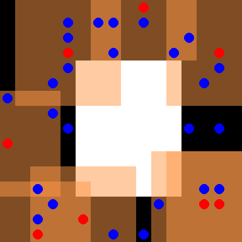

<div align="center">
<!-- Add your project logo if you have any -->


</div>

<h1 align="center">Multi Agent Project</h1>

<div align="center">

<!-- Use Shields website (link in acknowledgement section) to generate these for your repo or just replace the links here with yours -->
</div>

<hr />
<br />


<hr />

<p align="center">
MAC PER is a multi agent framework based on DDQN and [Prioritized Experience Replay](https://arxiv.org/abs/1511.05952). 
	<a href="[https://github.com/github_username/github_repo_link/issues](https://arxiv.org/abs/1511.05952)">Prioritized Experience Replay</a>
	
</p>

## 🧐About

MAC PER offers an introduction to PER and multi agent environments using the Petting-zoo API. We test our solution on the pursuit environment with three different modes. 

## 💡Features

The projects provide implementation of:
1. Standart DDQN agents.
2. PER based agents.
3. PER with buffer shraing between the agents.

## ⛏️Built with

-   []()
-   []()

## 🏁Getting Started

These instructions will help you to setup your own copy of project_name on your local machine for development and testing purposes. See [deployment](#Deployment) for notes on how to deploy the project on a live system.

### 📚Prerequisite

-   Python 3
-   Keras
-   TensorFlow 2
-   PettingZoo
-   Panda
-   Pickle

### 🧰Installation

1. []()
1. [.]()

    ```bash
    write code or commands like this
    ```

1. `and small snippets like this`

## 🚀Deployment

1. []()
1. []()


## 🎈Usage

How to use your project


## 🧬Resources

<!-- Add links to all the resources you followed or referred to -->

-   [MAC Control Framework](https://github.com/sarah-keren/MAC)
-   [pythonlessons/Reinforcement_Learning](https://github.com/pythonlessons/Reinforcement_Learning/tree/master/05_CartPole-reinforcement-learning_PER_D3QN)

## 🎉Acknowledgement

-   [pythonlessons/Reinforcement_Learning](https://github.com/pythonlessons/Reinforcement_Learning/tree/master/05_CartPole-reinforcement-learning_PER_D3QN)
